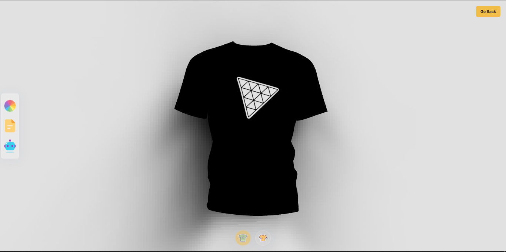

# AI-Powered 3D Website Using React - Three JS - AI

## Introduction
Many large corporations already use 3D graphics to showcase their products. so I built my own ThreeJS 3D product website and infuse it with the power of artificial intelligence! 

- ThreeJS - a powerful 3D graphics library for rendering and animating the 3D model
- React Three Fiber - a popular library for creating 3D graphics with ThreeJS in React
- TailwindCSS - a popular utility-first CSS styling framework
- Framer Motion - the most popular library used to bring your React website to life with animations

Also,
- Load, create and customize stunning 3D models and geometries with various lights, as well as understand the 3D world with a camera and positioning of an object in space.
- Make your code reusable and scalable using Higher Order Components (HOCs) and other industry-standard best practices
- Add custom color and file support.
- Generate and use images through DALLE AI
- Download the resulting t-shirt model image
- Ensure responsiveness across all devices and improve your site's performance

## <a>⚙️ Tech Stack</a>

- React.js
- Three.js
- React Three Fiber
- React Three Drei
- Vite
- Tailwind CSS
- Node.js
- Express.js
- OpenAI
- Framer Motion
- Valtio

## Demo

If you want to contact me you can reach me at [Live Site](https://dedeportfolio.vercel.app/).

## Contact

If you want to contact me you can reach me at [Linkedin](https://www.linkedin.com/in/dee-prince-dede-970913217/).
